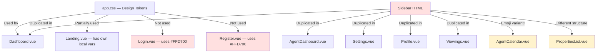

# Design Review Results: RealtyLinkPH — All Pages

**Review Date**: 2026-03-10  
**Routes Reviewed**: `/`, `/login`, `/register`, `/dashboard`, `/properties`, `/property/:id`, `/saved-properties`, `/viewings`, `/profile`, `/settings`, `/agent/dashboard`, `/agent/properties`, `/agent/calendar`, `/conversations`, `/admin/dashboard`  
**Focus Areas**: Visual Design, UX/Usability, Responsive/Mobile, Accessibility, Micro-interactions/Motion, Consistency, Performance

> **Visual Review**: Live screenshots captured at `http://localhost:8000` (Landing, Login, Register). Authenticated pages (Dashboard, Properties, etc.) reviewed via static code analysis — route guard redirects unauthenticated visitors as expected.

---

## Visual Screenshots Summary

| Page | Key Observations |
|------|-----------------|
| **Landing (`/`)** | Hero looks polished. Feature cards render cleanly. **Properties grid shows completely blank** — no skeleton loader, just empty white space (likely empty DB). Large orange border visible on right edge (ChatBubble element). |
| **Loading Screen** | "PH" renders in **amber `#D4A853`** — a third yellow variant (neither teal `#2CB5A0` nor Login gold `#FFD700`). |
| **Login (`/login`)** | Backdrop blur shows orange-red tones behind the modal. **Emoji icons (📧, 🔐) render as blurry colored squares** in inputs. Yellow "Forgot password?" and outline button — clear brand mismatch. Black Sign In button vs teal brand. |
| **Register (`/register`)** | Gold `#FFD700` "PH" text. **Unexplained yellow left-border stripe** on the modal card. Same emoji icon issues. |

---

## Summary

RealtyLinkPH has a solid foundation with a clear design intent (frosted teal theme, dark sidebar, card-based layouts) but suffers from significant consistency fragmentation across pages. The most critical concerns are: a brand color split between auth pages (gold `#FFD700`) and the main app (teal `#2CB5A0`), near-total sidebar code duplication across 10+ files, multiple WCAG contrast failures, and several broken navigation links. The codebase has grown page-by-page without extracting shared components, leading to ~15,000+ lines of duplicated HTML/CSS that will become very expensive to maintain.

---

## Issues

| # | Issue | Criticality | Category | Location |
|---|-------|-------------|----------|----------|
| 1 | **Broken internal link**: Login.vue links to `/forgot-password` but the actual router route is `/reset-password` → 404 on click | 🔴 Critical | UX/Usability | `resources/js/pages/Login.vue:97` |
| 2 | **Brand color mismatch**: Login & Register use `#FFD700` (gold) for all interactive accents, while the rest of the app uses `#2CB5A0` (teal) — users see two different brand identities | 🔴 Critical | Consistency | `resources/js/pages/Login.vue:528,562`, `resources/js/pages/Register.vue:599,620` |
| 3 | **WCAG contrast failure**: `.btn-signup:hover` and `.btn-signin:hover` render white text `color: white` on a `#FFD700` yellow background → 1.07:1 contrast ratio (needs 4.5:1) — text is nearly invisible | 🔴 Critical | Accessibility | `resources/js/pages/Login.vue:641-647`, `resources/js/pages/Register.vue:711-718` |
| 4 | **WCAG contrast failure**: `.alert-success` uses `color: #3c3` (#33CC33) on white → 3.9:1 ratio, fails WCAG AA for normal text (requires 4.5:1) | 🔴 Critical | Accessibility | `resources/js/pages/Login.vue:418-422`, `resources/js/pages/Register.vue:474-478` |
| 5 | **WCAG contrast failure**: Global `--success: #00C800` (#00C800) on white background → ~3.4:1 ratio, fails WCAG AA | 🔴 Critical | Accessibility | `resources/css/app.css:30` |
| 6 | **No 404 catch-all route**: Unknown paths render a completely blank page with no user feedback or redirect | 🔴 Critical | UX/Usability | `resources/js/router/index.js` (entire file — route missing) |
| 7 | **Sidebar fully duplicated** in every page (10+ files, ~80-100 lines per copy). No shared `Sidebar.vue` component exists — any sidebar change must be made in 10+ places manually | 🟠 High | Consistency | `resources/js/pages/Dashboard.vue:7-89`, `resources/js/pages/AgentDashboard.vue:7-92`, `resources/js/pages/Settings.vue:5-87`, `resources/js/pages/Profile.vue:5-88`, `resources/js/pages/Viewings.vue:5-81` (and 5+ more) |
| 8 | **Emoji icons in AgentCalendar sidebar nav**: Uses `📊`, `🏠`, `📅`, `📆`, `📄`, `💬`, `👤`, `⚙️` emojis as nav icons — inconsistent with SVG icons on all other pages and inaccessible to screen readers | 🟠 High | Consistency, Accessibility | `resources/js/pages/Agent/AgentCalendar.vue:14-56` |
| 9 | **Emoji icons in Login/Register form fields**: `📧` (email), `🔐` (password), `👤` (name) used as `.input-icon` — these are decorative but have no `aria-hidden="true"`, making screen readers announce emoji names | 🟠 High | Accessibility | `resources/js/pages/Login.vue:45,65`, `resources/js/pages/Register.vue:45,65,89` |
| 10 | **Clickable div/cards without keyboard support**: Stat cards, property cards, and Quick Action cards use `@click="$router.push()"` on `
` elements. These are completely inaccessible via keyboard (no `tabindex="0"`, no `@keydown.enter`) | 🟠 High | Accessibility | `resources/js/pages/Dashboard.vue:212-244,270-302,334-365` |
| 11 | **Missing ARIA labels on icon-only buttons**: Hamburger button (all pages), notification bell, property save/heart button all have no `aria-label`. Screen readers cannot describe these controls. | 🟠 High | Accessibility | `resources/js/pages/Dashboard.vue:101-103,108-111`, and all other page topbars |
| 12 | **PropertiesList sidebar nav items don't close mobile sidebar**: All other pages have `@click="sidebarOpen = false"` on sidebar nav items; PropertiesList.vue sidebar links are missing this, trapping the user behind the open overlay on mobile | 🟠 High | Responsive/Mobile | `resources/js/pages/PropertiesList.vue:17-77` |
| 13 | **PropertiesList sidebar missing Logout button**: Every other authenticated page sidebar includes a Logout button in the footer; PropertiesList.vue sidebar footer only shows the user card | 🟠 High | UX/Usability | `resources/js/pages/PropertiesList.vue:79-88` |
| 14 | **`console.log` in production router guard**: Navigation guard logs on every route change in production, exposing user role data | 🟠 High | Performance | `resources/js/router/index.js:328-330,335,340` |
| 15 | **Monolithic page files**: Landing.vue (2366 lines), Dashboard.vue (1395 lines), AgentDashboard.vue (1110 lines) are single-file components with all logic, template, and styles inline. This harms maintainability, code splitting, and initial parse time | 🟠 High | Performance | `resources/js/pages/Landing.vue`, `resources/js/pages/Dashboard.vue`, `resources/js/pages/AgentDashboard.vue` |
| 16 | **Three different sidebar nav HTML structures** coexist: (A) `nav-icon-wrap`+SVG (Dashboard, Viewings), (B) `nav-icon`+SVG+`nav-label` (PropertiesList), (C) emoji+`nav-label` (AgentCalendar). Same UI component, 3 implementations | 🟡 Medium | Consistency | `resources/js/pages/Dashboard.vue:15-62`, `resources/js/pages/PropertiesList.vue:16-77`, `resources/js/pages/Agent/AgentCalendar.vue:12-57` |
| 17 | **Duplicate CSS transition definitions**: `slide-left` and `slide-right` transition classes are defined twice in `app.css` (once at lines 90–121, again at 972–1001). The duplicate adds dead weight and is a maintenance hazard | 🟡 Medium | Consistency | `resources/css/app.css:90-121` and `resources/css/app.css:972-1001` |
| 18 | **Misleading CSS variable name `--palace-gold`**: This variable stores `#2CB5A0` — a teal/mint color — not gold. Extremely confusing for any developer reading the codebase | 🟡 Medium | Consistency | `resources/css/app.css:14-16` |
| 19 | **Landing page uses its own local CSS variable system**: Landing.vue defines `--stone-600`, `--stone-100`, `--navy`, `--radius-pill`, `--radius`, `--gold3` etc. locally — these are disconnected from the global `app.css` design tokens | 🟡 Medium | Consistency | `resources/js/pages/Landing.vue` (scoped style block, ~lines 800-1100) |
| 20 | **Three different font families** used across the app with no coordination: Body uses `'Open Sans'/'Roboto'` (app.css), Login/Register import and use `'Plus Jakarta Sans'`, App.vue loading screen uses `'Playfair Display'/'Inter'`. No unified typography system | 🟡 Medium | Visual Design, Consistency | `resources/css/app.css:45-46`, `resources/js/pages/Login.vue:241`, `resources/js/App.vue:196` |
| 21 | **Global `h2::after` underline accent applied everywhere**: The decorative teal bottom-border added to all `<h2>` elements via `h2::after` in `app.css` shows up in unexpected places (sidebar section labels, modal headings) | 🟡 Medium | Visual Design | `resources/css/app.css:177-186` |
| 22 | **`window.__showLoading` and `window.__hideLoading` global pollution**: These globals are assigned in `App.vue` for cross-component communication — a Vue anti-pattern that breaks SSR compatibility and makes components untestable | 🟡 Medium | Performance | `resources/js/App.vue:87-88` |
| 23 | **No max-height on notification dropdown panel**: The `.notif-panel` can grow taller than the viewport on mobile with many notifications, pushing content off-screen with no scroll | 🟡 Medium | Responsive/Mobile | `resources/js/pages/Dashboard.vue:113-136` |
| 24 | **Card hover `translateY(-8px)` is too aggressive**: The global `.card:hover` lifts cards 8px — this is excessive for dense list/grid pages and causes layout jitter on fast cursor movement | 🟡 Medium | Micro-interactions | `resources/css/app.css:490-495` |
| 25 | **Button ripple effect grows to 300×300px**: The `.btn::before` ripple pseudo-element expands to a 300px circle — on small buttons (`.btn-small`) this visually overflows the button boundary | 🟡 Medium | Micro-interactions | `resources/css/app.css:249-266` |
| 26 | **Auth token stored in `localStorage`**: Susceptible to XSS attacks. Using `HttpOnly` cookies (handled server-side by Laravel Sanctum) would be significantly more secure | 🟡 Medium | UX/Usability | `resources/js/pages/Login.vue:187-188`, `resources/js/router/index.js:326` |
| 27 | **Login form uses `<h1>` for "Login your account"**: Heading hierarchy issue — the login modal already has a brand heading above it. The form title should be `<h2>` | ⚪ Low | Accessibility | `resources/js/pages/Login.vue:26` |
| 28 | **`style="margin-top:24px"` inline style on Login forgot-sent button**: Hardcoded inline style bypasses the design system | ⚪ Low | Consistency | `resources/js/pages/Landing.vue:428` |
| 29 | **Viewings.vue hardcoded `user-role` text as "Buyer"**: The sidebar footer user role display is hardcoded as "Buyer" string instead of using the dynamic `userRole` variable | ⚪ Low | UX/Usability | `resources/js/pages/Viewings.vue:65` |
| 30 | **Footer links are `<a href="#">`**: Terms of Service, Privacy Policy, and Contact Us links in the landing footer all point to `#` — dead links that should route to real pages or at least show a toast | ⚪ Low | UX/Usability | `resources/js/pages/Landing.vue:298-308` |
| 31 | **Inconsistent border-radius values**: Global tokens have `--radius-sm/md/lg/xl`, but Login/Register use hardcoded `border-radius: 12px`, `border-radius: 20px`; Landing.vue uses `--radius-pill` locally. No single source of truth | ⚪ Low | Consistency | `resources/js/pages/Login.vue:295,330`, `resources/js/pages/Register.vue:341` |
| 32 | **Missing `loading="lazy"` on property card images in Landing.vue**: Property images in the featured properties grid don't use lazy loading, causing unnecessary initial page weight | ⚪ Low | Performance | `resources/js/pages/Landing.vue:172` |
| 33 | **Three different "PH" brand accent colors**: Landing navbar uses teal `#2CB5A0`, Login/Register use gold `#FFD700`, loading screen uses amber `#D4A853` — the brand identity is fragmented across three shades | 🟠 High | Visual Design, Consistency | `resources/js/App.vue:205` (`.rl-gold`), `resources/js/pages/Login.vue:358`, `resources/css/app.css:14` |
| 34 | **Landing page LCP of ~47 seconds** (measured live): The hero background image is extremely large, causing a 47-second Largest Contentful Paint — a critical SEO and UX performance failure | 🔴 Critical | Performance | `resources/js/pages/Landing.vue` (hero section, background image) |
| 35 | **Properties grid shows blank white space when empty**: No loading skeleton or improved empty state — when no properties exist, the "Featured Listings" section displays only blank white area with no explanation | 🟡 Medium | UX/Usability | `resources/js/pages/Landing.vue:232-235` |
| 36 | **Unexplained yellow stripe on Register modal**: A yellow left-border stripe is visible on the register card in live view — likely from a parent element bleeding in, not clearly in the component's own CSS | 🟡 Medium | Visual Design | `resources/js/pages/Register.vue` (scoped styles) |
| 37 | **ChatBubble renders a large orange rectangle on landing page right edge**: The global `<ChatBubble>` appears to be rendering an oversized element on the public landing page | 🟡 Medium | Visual Design | `resources/js/App.vue:32`, `resources/js/components/ChatBubble.vue` |

---

## Criticality Legend
- 🔴 **Critical**: Breaks functionality, WCAG violations, or blocks users entirely
- 🟠 **High**: Significantly impacts UX, consistency, or technical debt
- 🟡 **Medium**: Noticeable degradation in quality or developer experience
- ⚪ **Low**: Minor polish improvements

---

## Architecture Flow

---

## Next Steps (Prioritized)

### 🔴 Fix Immediately (Critical)
1. **Fix the broken Forgot Password link** in `Login.vue` → change `to="/forgot-password"` to `to="/reset-password"`
2. **Fix button hover contrast**: Change `color: white` to `color: #1a1a1a` on yellow hover states in Login/Register
3. **Fix alert-success text color**: Change `#3c3` to `#1a7a2e` (passes WCAG AA at 4.5:1+)
4. **Fix --success color**: Change `#00C800` to `#16a34a` (tailwind green-600, 4.5:1+ on white)
5. **Add a 404 catch-all route** (`path: '/:pathMatch(.*)*'`) redirecting to login or a 404 page

### 🟠 Address Soon (High Priority)
6. **Extract a shared `Sidebar.vue` component** — eliminate duplication across all page files
7. **Unify AgentCalendar.vue navigation icons** — replace emoji with SVG icons matching other pages
8. **Replace emoji form icons** with SVG icons + `aria-hidden="true"` on decorative icons
9. **Add keyboard accessibility** to clickable cards — add `tabindex="0"`, `role="button"`, `@keydown.enter`
10. **Add `aria-label`** to all hamburger, notification, and save buttons
11. **Fix PropertiesList sidebar** — add `@click="sidebarOpen = false"` to nav items, add Logout button
12. **Remove all `console.log`** from the router guard

### 🟡 Planned (Medium Priority)
13. **Consolidate design tokens** — remove Landing.vue's local CSS variables and use global `app.css` tokens
14. **Rename `--palace-gold`** to `--teal` or `--accent` in `app.css` and update all 100+ usages
15. **Remove duplicate slide transitions** from `app.css` (lines 972-1001)
16. **Unify typography** — pick one font (recommend keeping `Plus Jakarta Sans` from Login/Register for the whole app, or use the global one consistently)
17. **Align Login/Register brand color** with the main app's teal `#2CB5A0`
18. **Add `max-height` + `overflow-y: auto`** to the notification dropdown panel
19. **Reduce card hover lift** from `translateY(-8px)` to `translateY(-3px)`
20. **Scope the `h2::after` decorator** — apply it only via a utility class (`.decorated-heading`) instead of all `h2` globally

### ⚪ When Time Permits (Polish)
21. Fix hardcoded user role text in `Viewings.vue:65`
22. Replace `<a href="#">` footer links with real routes or `router-link`
23. Unify border-radius values through design tokens
24. Add `loading="lazy"` to property images in Landing page
25. Move loading screen control from `window.__showLoading` to a Pinia store or event bus
